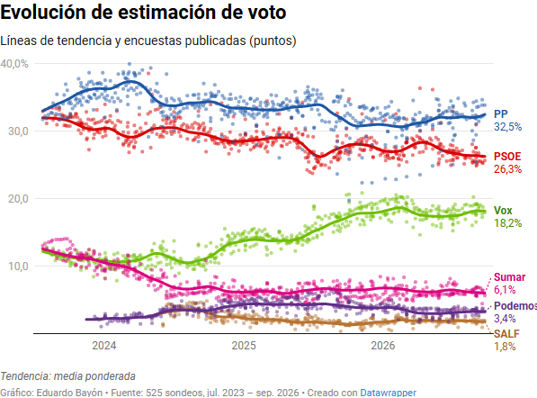

# 05 · Gráfico del promedio en el dashboard

Estado: **hecho** (octubre de 2026). Código al final de `app.js` («CIS · Análisis del voto: promedio de encuestas»).

Referencia visual obligatoria: [referencia_grafico_promedio.png](referencia_grafico_promedio.png). El gráfico tiene que verse así, con la identidad de Silván & Miracle (tipografía Inter / Instrument Serif, tarjeta y colores del dashboard).



## Ubicación

- Pestaña propia **Evolución encuestas** (`#tab-enc`, `#grid-enc`), la primera del dashboard y la que se abre por defecto. Enlace directo: `#encuestas`.
- **Primera tarjeta**, ancho completo (`card` sin `span`), por encima de la intención de voto del CIS. Como las tarjetas se añaden en el orden en que se ejecuta `app.js`, insertar con `grid.prepend(card)`.
- Si `promedio.json` no existe o falla, la tarjeta no aparece y el resto de la pestaña funciona igual.

## Elementos

| Elemento | Especificación |
|---|---|
| Título (`h3`) | «Evolución de estimación de voto» |
| Subtítulo (`.subt`, serif) | «Líneas de tendencia y encuestas publicadas (puntos)» |
| Puntos | Un punto por sondeo y partido, en la fecha del sondeo. Color del partido, opacidad 0,35-0,45, tamaño 4-5 px, sin borde |
| Líneas | Tendencia diaria de `tendencia.*`. Color del partido, grosor 3 px, suavizado (`smooth: 0.3`), sin marcadores, por encima de los puntos (`z` mayor) |
| Etiqueta final | A la derecha de cada línea, en dos renglones: nombre del partido en negrita y último valor («32,5 %»), del color del partido. Si dos etiquetas se solapan (Podemos/SALF), desplazarlas en vertical |
| Eje Y | 0 a 40 (máximo dinámico: múltiplo de 10 por encima del máximo de los puntos). Etiquetas con coma decimal; la de arriba con «%» («40,0 %»), como en la referencia. Rejilla horizontal fina |
| Eje X | Temporal, desde el 23-07-2023 hasta hoy. Etiquetas solo de años (2024, 2025, 2026) |
| Margen derecho | Suficiente para las etiquetas finales (unos 70 px; menos en el móvil) |
| Pie (`.foot-note`) | «Tendencia: media ponderada por antigüedad y tamaño de la muestra. Fuente: Wikipedia, N sondeos (jul. 2023 – oct. 2026). Actualizado el 5 de octubre de 2026.» con N, fechas y actualización leídos de `promedio.json` |
| Logo | El logo reducido de S&M abajo a la derecha, como en el resto de gráficos (`smBaseOption()`) |
| Exportar | Botón «⬇ PNG» (`export-btn`) igual que las demás tarjetas |

## Partidos y colores

Los de `PARTY_COLORS` en `app.js`, para que coincidan con el resto del dashboard:

| Partido | Color |
|---|---|
| PP | `#1E73C4` |
| PSOE | `#E5393B` |
| Vox | `#8BC34A` |
| Sumar | `#E5007D` |
| Podemos | `#6A2C91` |
| SALF | `#6D4C41` (añadir alias `"SALF"` a `PARTY_COLORS`) |

## Interacción

- **Tooltip** al pasar por una línea: fecha y valor de los seis partidos ese día, ordenados de mayor a menor.
- **Tooltip** al pasar por un punto: empresa, fecha, muestra y valor del partido.
- **Chips de partido** (el mismo componente `.chips` que ya usa la intención de voto) para ocultar o mostrar partidos.
- **Selector de periodo** (`.seg`): Todo · Último año · Últimos 6 meses. Cambia el rango del eje X (`dataZoom` o `min` del eje).
- **Móvil** (`esMovil()`): altura 360 px, etiquetas finales más pequeñas, puntos de 3 px.

## Esquema de la opción de ECharts

```js
const opt = {
  ...smBaseOption(),
  grid: { left: 8, right: esMovil() ? 56 : 78, top: 16, bottom: 30, containLabel: true },
  xAxis: { type: "time", min: P.desde, max: P.hasta,
           axisLabel: { formatter: "{yyyy}" }, splitLine: { show: false } },
  yAxis: { type: "value", min: 0, max: yMax, interval: 10,
           axisLabel: { formatter: v => v === yMax ? fmt1(v) + " %" : fmt1(v) },
           splitLine: { lineStyle: { color: SM.c.grid } } },
  series: partidos.flatMap(p => [
    { type: "scatter", name: p.id, data: puntos(p.id), symbolSize: 4.5,
      itemStyle: { color: p.color, opacity: 0.4 }, z: 2 },
    { type: "line", name: p.id, data: linea(p.id), showSymbol: false, smooth: 0.3,
      lineStyle: { width: 3, color: p.color }, z: 3,
      endLabel: { show: true, color: p.color, fontWeight: 600,
                  formatter: () => `${p.nombre}\n${fmt1(P.ultimo[p.id])} %` },
      labelLayout: { moveOverlap: "shiftY" } }
  ])
};
```

`fmt1` = número con una decimal y coma. Definirlo como `v => v.toLocaleString("es-ES",{minimumFractionDigits:1,maximumFractionDigits:1})`, que es el patrón que ya usa `app.js`.

## Carga de datos

En `index.html`, cargar `promedio.json` en paralelo a `data.json` y **sin bloquear** el dashboard si falla:

```js
Promise.all([
  fetch("data.json",     {cache: "no-cache"}).then(r => r.json()),
  fetch("promedio.json", {cache: "no-cache"}).then(r => r.ok ? r.json() : null).catch(() => null)
]).then(([d, p]) => { window.DATA = d; window.PROMEDIO = p; /* cargar app.js */ });
```

## Criterios de aceptación

- Con el `promedio.json` real, el gráfico se reconoce a simple vista como la referencia: nube de puntos, seis líneas suaves y etiquetas finales con nombre y valor.
- Funciona en escritorio y a 400 px de ancho sin solaparse las etiquetas.
- Sin `promedio.json`, la pestaña Análisis del voto se ve exactamente como ahora.
